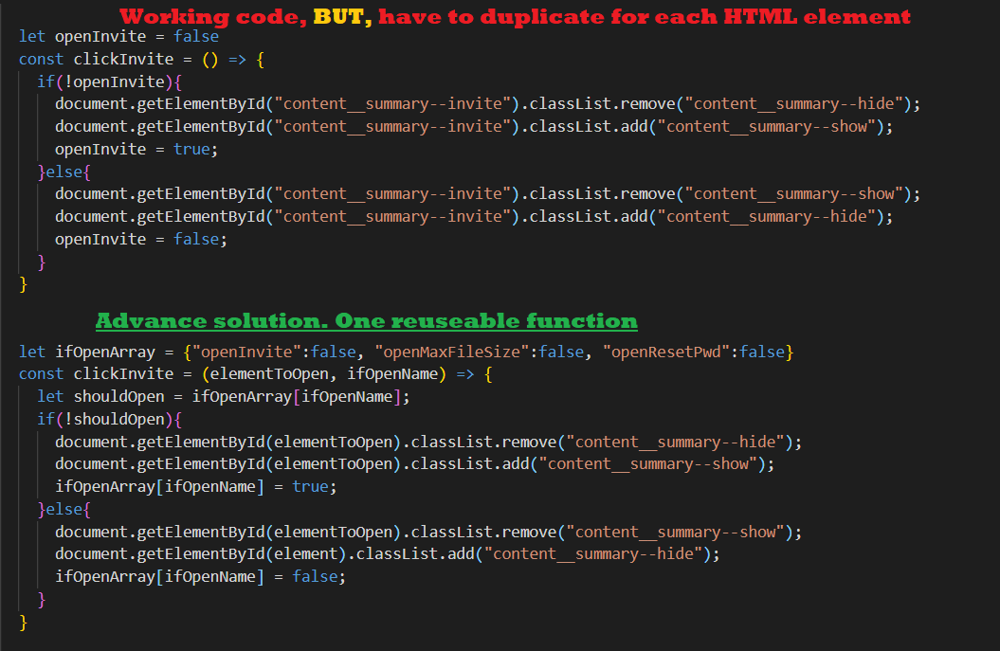

# FAQ Accordion component with HTML, CSS, & JS

This is a solution to the [FAQ Accordion component challenge on Frontend Mentor](https://www.frontendmentor.io/challenges/profile-card-component-cfArpWshJ). Frontend Mentor challenges help you improve your coding skills by building realistic projects.

## Table of contents

- [The challenge](#the-challenge)
- [Links](#links)
- [Built with](#built-with)
- [What I learned](#what-i-learned)
- [Useful resources](#useful-resources)
- [Author](#author)

### The challenge

- Build out the project to the designs provided.

### Links

- [Live Site URL](https://jcsmileyjr.github.io/FAQ-Accordion/)
- [Read the blog post](https://dev.to/jcsmileyjr/frontend-challenge-5-faq-accordion-21p9)

### Built with

- Semantic HTML5 markup
- CSS custom properties
- Flexbox
- Mobile-first workflow
- Functionaliy with vanilla JavaScript

### What I learned

1. Mimic an accordion object functionality without using Detail and Summary HTML5 elements.
2. Practice CSS styling like CSS background gradient
3. Stacking, positioning, and layering images with CSS
4. Practice CSS functionality on the webpage like animating elements while hovering.

Below is code I'm proud of

### Useful resources

- [HTML5 Responsive Images BY CSS-TRICKS](https://css-tricks.com/responsive-images-css/)
- [Mimic HTML5 Accordion elements](https://evolvingweb.ca/blog/building-accordions-html5-details-tag-no-javascript-needed)
- [Tips on hiding and positioning images](https://stackoverflow.com/questions/5513382/absolute-position-and-overflowhidden)

## Author

- Website - [JC Smiley](https://www.jcsmileyjr.com)
- Frontend Mentor - [@jcsmileyjr](https://www.frontendmentor.io/profile/jcsmileyjr)
- Twitter - [@JCSmiley4](https://twitter.com/JCSmiley4)
